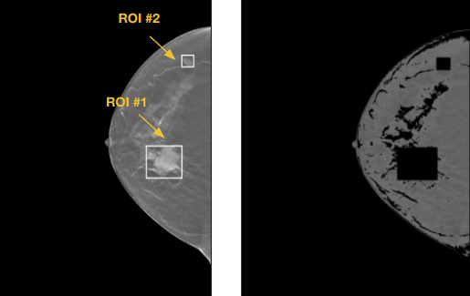

# Image Processing for Digital Breast Tomosynthesis 

Digital Breast Tomosynthesis (DBT) involves the reconstruction of 3D images from 2D X-ray projections, acquired within a limited angular range. These images offer clinicians cross-sectional visualization through slices. Unlike traditional mammography, DBT images avoid tissue super-positioning, enable volume analysis, and enhance cancer detection capabilities. Nonetheless, they suffer from drawbacks such as longer interpretation time per patient, storage issues, and significant image noise levels [2],[3].

To address these challenges, a solution is proposed: the projection of slab images from the slice images, which reduces the time spent interpreting each DBT image by clinicians. Several slabbing techniques are employed to generate these slab projections. Generally, slices have a thickness of 1 mm, while slab images have a thickness of 10 mm following the standard protocol [4].

In this project, various configurations for slab generation were implemented to achieve objectives such as improved image quality, enhanced clinical interpretability, and better predictive performance.
This project was conducted in the scope of the practical course [Project Management and Software Development for Medical Applications](https://wiki.tum.de/pages/viewpage.action?pageId=1370426552) offered by the CAMP chair at the Technical University of Munich in the summer semester 2023. My project supervisor was Mickael Tardy, research engineer at the company [Hera-MI](https://www.hera-mi.com/en/). 

## Image Processing 

[Fiji](https://imagej.net/software/fiji/) was used to process and analyze the DBT slice images while working on image processing techniques. Additionally, [Weasis](https://weasis.org/en/), which is a software program for medical image visualization and analysis, was used to read the DICOM files.

### Slab Generation Techniques

Three different slabbing techniques were implemented for the image processing of DBT: maximum intensity projection (MIP), average intensity projection (AIP), and softMIP [2].
Each technique offers its own advantages and disadvantages in terms of contrast and noise levels. 
_Maximum intensity projection_ has high contrast results, high noise level, low contrast-to-noise ratio,
and yields better for micro-calcifications. _Average intensity projection_ has low contrast results, 
low noise level, and smoothing images which is worse for micro-calcifications. _sofftMIP_ proposes an optimized
performance between MIP and AIP by using a weighted projection function.

<p align="center">
    
</p>

### Slice/Slab Image Preprocessing 

Background noise is removed from each of the slice images before employing the projection methods. For background noise removal, firstly breast tissue is segmented from the slice image by using triangle thresholding. Then, the background is set to zero. If breast skin is also desired to be removed, then breast skin is segmented by using the morphological operation 'erosion'.

The slice images are rescaled to the range of (0,1) by preserving the pixel range, i.e. min-max normalization is not applied to the slice images from the DICOM files. If the slab images are read for image quality assessment directly from the saved PNG files, then min-max normalization is applied to the slab images individually. 

## Dataset 

[Breast Cancer Screening - Digital Breast Tomosynthesis](https://wiki.cancerimagingarchive.net/pages/viewpage.action?pageId=64685580) of Duke University, which is a public dataset, was used in this project [5]. The training dataset with boxes indicates lesion locations. Here are the four classes of DBT volumes:
- normal
- actionable
- biopsy-proven benign (with boxes)
- biopsy-proven cancer (with boxes)

Codes for preprocessing and drawing boxes were provided by the Mazurowski Lab's [github repo](https://github.com/mazurowski-lab/duke-dbt-data). For further information, you can check their article [here](https://arxiv.org/pdf/2011.07995.pdf). 

## Project Pipeline & Data Organization

<p align="center">
    
</p>

- Dataset files from the public dataset are stored inside `/data/dataset`. 
- DICOM files are downloaded inside `/data/input`. 
- Generated configurations are saved inside `data/output/{config_hash_code_X}`, where config hash code is generated from the dictionary inside
`data/output/{config_hash_code_X}/{config_hash_code_X.json}` by using the SHA-256 Algorithm. JSON files contain the slab generation configuration setting.
- Each configuration has results for all of the input DICOM files. The generated slabs are saved inside `data/output/{config_hash_code_X}/{series_instance_uid_X}`.
- DICOM files are named with their Series Instance UID (unique identifier) after downloading and tracked by their Series Instance UID. 

Here is the hierarchical structure of the data folder:

```
- data
  - dataset
    - BCS-DBT boxes-train-v2.csv
    - BCS-DBT file-paths-train-v2.csv
    - BCS-DBT labels-train-v2.csv

  - input
    - series_instance_uid_Y.dcm
    - ...

  - output
    - config_hash_code_X
      - config_hash_code_X.json
      - series_instance_uid_Y
           series_instance_uid_Y_slab_1.png
           series_instance_uid_Y_slab_2.png
           ...
      - ...
    - ...
```

## Configurations  

### 1. Program Setting

See [config/settings.yaml](/config/settings.yaml) for more information.

_Data Management_
- Data directories: config directory, data directory, input directory, output directory.
- Bit depth to save PNG files  

_Evaluation_
- Image quality assessment metrics: CNR, contrast
- Classification performance metrics: list of performance metrics, op shifts, positive threshold number.

### 2. Slab Generation Configuration Settings

See [config/slab_configs.yaml](/config/slab_configs.yaml) for more information.

_Slab Generation Parameters_
- `projection_method`: list of projection methods 
- `thickness_overlap`: list of pairs of thickness and overlap
- `slice_skip_ratio`: list of pairs of slice skip ratios with the order of [top, bottom]
- `breast_skin_removal`: 0 for no removal / 1 for full removal
- `breast_skin_kernel_size`: list of kernel sizes, default is 7  
- `breast_skin_iteration_number`: list of iteration numbers, default is 1

### 3. Dataset Settings

See [config/dataset.yaml](/config/dataset.yaml) for more information.

_Data Management_
- Data directories: input directory, dataset directory.
- Dataset: file paths of dataset, train dataset, train dataset with boxes, and train dataset with labels.

_Cloud Database_ 
- Base URL to download DICOM files 
- DICOM file number to download DICOM files 

  
## Program 

### How to run the program? 

**1. Prepare dataset**

Run the Python script with the configuration YAML file [config/dataset.yaml](/config/dataset.yaml).
Navigate to the root directory containing `prepare_dataset.py`, and run the script with the configuration file argument:

```
python3 prepare_dataset.py --config_dataset config/dataset.yaml
```

If you have other DICOM files than the public dataset, you can also add them to the input folder. The dataset is needed mainly for IQA metrics with boxes and classification performance metrics with labels. 

**2. Slab generation**

Run the Python script with the configuration YAML file [config/settings.yaml](/config/settings.yaml) and [config/slab_configs.yaml](/config/slab_configs.yaml).
Navigate to the root directory containing `generate_slabs.py`, and run the script with the configuration file arguments:

```
python3 generate_slabs.py --config_settings config/settings.yaml --config_slabs config/slab_configs.yaml
```

Firstly, every possible combination of configurations is generated and saved inside [data/output](/data/output). 
Then, the generated slabs are saved inside the config folders. 

**3. Compute IQA metrics**

IQA metrics are computed on the PNG files after running slab generation. 

Run the Python script with the configuration YAML file [config/dataset.yaml](/config/dataset.yaml) and [config/settings.yaml](/config/settings.yaml).
Navigate to the root directory containing `compute_iqa_metrics.py`, and run the script with the configuration file arguments:

```
python3 compute_iqa_metrics.py --config_settings config/settings.yaml --config_dataset config/dataset.yaml 
```

Computed IQA metrics are saved inside [data/output/iqa_metrics](data/output/iqa_metrics). Here is the hierarchical structure of the IQA metrics folder under the output folder:

```
- data
  - output
    - config_hash_code_X
    - ...

    - iqa_metrics
      - config_hash_code_X
        - iqa_metrics_{series_instance_uid_1}.json
        - iqa_metrics_{series_instance_uid_2}.json
        - ...
      - iqa_metrics.csv 
```

**4. Compute classification performance metrics**

After the classification models are run, prediction results are saved in JSON files. You need to move your predictions inside [data/output/predictions](data/output/predictions).

Run the Python script with the configuration YAML file [config/dataset.yaml](/config/dataset.yaml) and [config/settings.yaml](/config/settings.yaml).
Navigate to the root directory containing `compute_performance_metrics.py`, and run the script with the configuration file arguments:

```
python3 compute_performance_metrics.py --config_settings config/settings.yaml --config_dataset config/dataset.yaml 
```

Computed performance metrics are saved inside [data/output/performance_metrics](data/output/performance_metrics). Here is the hierarchical structure of the performance_metrics metrics folder under the output folder:

```
- data
  - output
    - config_hash_code_X
    - ...

    - iqa_metrics

    - predictions
      - predictions_{config_hash_code_X}.json

    - performance
      - top_1
        - performance_metrics_{config_hash_code_X).json",
        - performance_metrics_op{op_shift)_top{pos_threshold_num}.csv",
      - top_2
      - top_3
      - performance_metrics.csv 
```
Performance metrics are saved for each configuration in JSON files. Afterward, performance metrics for all configurations are saved in a CSV file for each `op_shift` and `pos_threshold_num`. In the end, all of the results are saved in [data/performance/performance_metrics.csv](/data/performance/performance_metrics.csv).

### How to add new projection methods? 

Add your static method to the Projection class inside [src/projection.py](/src/projection.py) and also add its name to the projection function map.
If you would like to use your new projection method, you need to add its name to the list of `projection-method` inside [config/slab_configs.yaml](/config/slab_configs.yaml).

## Results

### 1. Image Quality Assessment Metrics

For image quality assessment, two metrics were used: 
- Contrast-to-Noise Ratio (CNR)
- Contrast. 

Here are the IQA metric definitions from the reference article [2]. 

$$ CNR = \frac{{\bar{P}\_{\text{object}} - \bar{P}\_{\text{background}}}}{{\sqrt{{\sigma^2\_{\text{object}} + \sigma^2\_{\text{background}}}}}} $$

$$ Contrast = \frac{{\bar{P}\_{\text{object}} - \bar{P}\_{\text{background}}}}{{\bar{P}\_{\text{object}} + \bar{P}\_{\text{background}}}}$$

No-reference methods were used for the IQA, avoiding the need for ground truth, i.e. reference images. 
For CNR and contrast, background annotations were needed. Instead of annotating the background regions, background regions were extracted by employing Li thresholding. 
Some CNR and contrast values were negative. These might have resulted from the wrong box coordinates of the images since some images have up-down flips. Left-right flips were already handled by comparing the view laterality of the dataset and also the real image laterality.

You can see one of the slab images with annotations in the figure below.

<p align="center">
    
</p>

Here, the steps for background segmentation are shown. 

<p align="center">
    
</p>

Boxes were given slice-wise in the public dataset as shown in the table below. Firstly, the slabs were defined by the boxes from slices indices. 

  | Slice | $x_1$ | $x_2$ | $y_1$ | $y_2$ |
  |:-------------:|:--------------:|:--------------:|:--------------:|:--------------:|
  |#21 | 1411 | 1535 | 1080 | 1172 | 
  |#26 | 1713 | 1834 | 478  | 583  | 
  |#29 | 1380 | 1724 | 1216 | 1487 |

Volumes with boxes were evaluated with IQA, which are the DBT images with the label of benign and cancer. 

<p align="center">
    
</p>

Mean values of CNR and Contrast were computed for each 
volume, and subsequently, the mean of means was
calculated for each configuration.

For the evaluation results with more information, see [evaluation_iqa.ipynb](/evaluation_iqa.ipynb).

**Note:** IQA metrics are not compatible with slice skipping property. You should set `slice_skip_ratio` to [0.0, 0.0] when you compute the IQA metrics to find the best configuration.

### 2. Classification Performance Metrics

The following classification performance metrics were used to 
assess the binary classification performance of the models: 

- Sensitivity (with Youden > 0.5)
- Specificity (with Youden > 0.5)
- Youden
- Area Under the Receiver Operating Characteristic curve (AUC ROC)
- Accuracy

When volumes are labeled, top prediction results are selected with top 1, top 2, and top 3. 
For example, to be able to label a volume as positive, at least three of the slabs should be predicted as positive. 
Mean values of performance metrics were computed for each configuration.

Volumes with the label of benign, cancer, and normal were evaluated. 
The positive class contains volumes with cancer labels. 
The negative class contains the volumes with normal and benign labels. 

SoftMIP appears to yield the best results with maximum Youden or maximum sensitivity (with Youden > 0.5).
The MIP method followed closely in performance, while the AIP method showed the lowest performance,
despite achieving the highest AUC when specificity was maximized.
 
For the evaluation results with more information, see [evaluation_performance.ipynb](/evaluation_performance.ipynb).

**Note:** For the updated results, please see [evaluation_iqa.ipynb](/evaluation_iqa.ipynb) and [evaluation_performance.ipynb](/evaluation_performance.ipynb) instead of the final presentation
since the evaluation had not been completed until the final presentation. To check for which DICOM files and which configurations the metrics were computed, please see [metrics/iqa_metrics_dicom_list.json](metrics/iqa_metrics_dicom_list.json) and [metrics/performance_metrics_dicom_list.json](metrics/performance_metrics_dicom_list.json).

## References 

[1] "Breast Imaging Diagnosis and Screening in Korea," Breast Imaging, 12th International Workshop IWDM, Gifu City, Japan, 2014, pp. xxvii-xxviii, doi: 10.1007/978-3-319-07887-8.
 
[2] F. Diekmann, H. Meyer, S. Diekmann, et al., "Thick Slices from Tomosynthesis Data Sets: Phantom Study for the Evaluation of Different Algorithms," Journal of Digital Imaging, vol. 22, no. 5, pp. 519-526, Oct. 2009, doi: 10.1007/s10278-007-9075-y

[3] A.C. Pujara, A.I. Joe, S.K. Patterson, C.H. Neal, M. Noroozian, T. Ma, et al. “Digital breast tomosynthesis slab thickness: impact on reader performance and interpretation time.” Radiology 2020, vol. 297, no. 3, pp. 534–42, Oct. 2020, doi: 10.1148/radiol.2020192805.

[4] M. Dustler, P. Timberg, A. Tingberg, and S. Zackrisson, "Image Quality of Thick Average Intensity Pixel Slabs Using Statistical Artifact Reduction in Breast Tomosynthesis," in Breast Imaging, 12th International Workshop IWDM, 2014, pp. 544-549, doi:10.1007/978-3-319-07887-8.

[5] M. Buda, A. Saha, R. Walsh, S. Ghate, N. Li, A. Święcicki, J. Y. Lo, M. A. Mazurowski, Detection of masses and architectural distortions in digital breast tomosynthesis: a publicly available dataset of 5,060 patients and a deep learning model. (https://doi.org/10.1001/jamanetworkopen.2021.19100).
 
